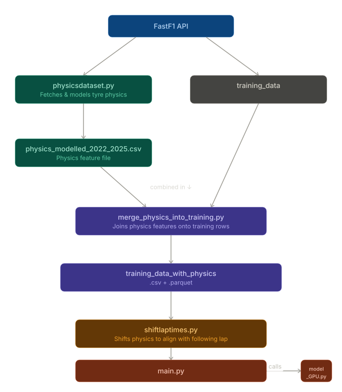

# Feature-engineered predictions

A physics-based model for predicting lap times based off engineered features, built on publicly available telemetry data via the FastF1 API.

This is a 10-credit group project for third-year EngMaths students at University of Bristol.

---

## Research Question

Can a physics-based model of features aid in neural network's prediction of lap time, and how can we use it to aid strategic decisions?

---


| Section | Description |
|---|---|
| [Research Question](#research-question) | What we're trying to answer |
| [Model Overview](#model-overview) | ODE system |
| [Repository Structure](#repository-structure) | Folder layout |
| [Setup](#setup) | Installation and data regeneration |
| [Dependencies](#dependencies) | Key packages |
| [Data](#data) | Available FastF1 channels |

## Model Overview

## Pipeline



...

---

## Repository Structure

```
f1-tyre-degradation/
├── data/
│   ├── raw/              # FastF1 cache (gitignored — see below)
│   └── processed/        # Cleaned stint data, cliff onset labels
├── notebooks/
│   ├── 01_data_exploration.ipynb
│   └── ... etc
├── src/
│   ├── data.py           # FastF1 pipeline and caching helpers
│   ├── model.py          # ODE system (thermal + degradation)
│   ├── plotting.py       # Shared figure utilities
|   └── ... etc
├── tests/
│   └── test_model.py
├── figures/              # Saved output figures
├── requirements.txt
└── README.md
```

Notebooks are for narrative and figures. All model logic would live in `src/` and be imported into notebooks.

---

## Setup

**Requirements:** Python 3.10+

1. Clone the repository:
   ```bash
   git clone https://github.com/Abhaybhabhu/MDM3---F1.git
   cd f1-tyre-degradation
   ```

2. Install dependencies:
   ```bash
   pip install -r requirements.txt
   ```

3. Regenerate the FastF1 data cache:
   ```bash
   python src/data.py
   ```
   (The idea is that this will pull telemetry for the configured races and cache locally to `data/raw/`. The cache would be gitignored due to size — it should be regenerated locally before running the notebooks.)

---

## Dependencies

Key packages (see `requirements.txt` for pinned versions):

- `fastf1` — F1 telemetry data
- `scipy` — ODE integration and optimisation
- `numpy`, `matplotlib`

## Data

FastF1 provides: lap times, tyre compound, tyre age, speed, throttle, brake, gear, DRS, x/y/z position, ambient temperature, track temperature.
